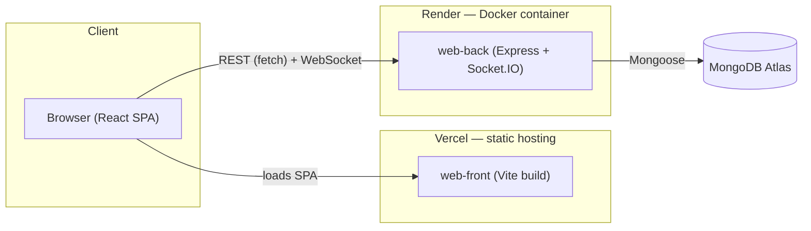

# WebReact

[](https://github.com/CF255/webreact-portfolio/actions/workflows/ci.yml)
[](./LICENSE)

Full-stack portfolio piece by **[Andrews Luis Fernandez](https://webreact-portfolio.vercel.app)**: a portal/dashboard app with real authentication, notes, real-time chat, and an admin panel — built to be explored publicly by recruiters/interviewers without creating an account.

**Live demo:** [webreact-portfolio.vercel.app](https://webreact-portfolio.vercel.app) — click "Explore the app (demo)" on the landing page, no signup needed.

---

## Contents

- [Architecture](#architecture)
- [Tech stack](#tech-stack)
- [Features](#features)
- [Technical highlights](#technical-highlights)
- [Project structure](#project-structure)
- [Getting started](#getting-started)
- [Environment variables](#environment-variables)
- [Running with Docker](#running-with-docker)
- [Tests](#tests)
- [CI/CD](#cicd)
- [Deployment](#deployment)
- [Login](#login)
- [Known limitations](#known-limitations)

## Architecture



- **Frontend**: React SPA, statically built and served from Vercel. Talks to the backend only via `fetch`/WebSocket over the public internet — no server-side rendering, no direct DB access.
- **Backend**: single Express process that serves the REST API and a Socket.IO server on the same port, containerized and deployed on Render.
- **Database**: MongoDB Atlas (managed, cloud-hosted) — the backend is the only thing that talks to it.

## Tech stack

### Frontend (`web-front`)
- React 18 + TypeScript + Vite
- `react-router-dom` v6 for app routing, `wouter` for the giffy module's sub-router
- Native `fetch` for HTTP, `socket.io-client` for real-time chat
- Bootstrap / per-module CSS (`public/css/*.css`) + FontAwesome
- Vitest + Testing Library for tests

### Backend (`web-back`)
- Node.js + Express (ES Modules)
- MongoDB + Mongoose
- Socket.IO for real-time messaging
- JWT (`jsonwebtoken`) with access + refresh token, revocable on logout
- `bcrypt` for password hashing
- `helmet` + `express-rate-limit` on login/signup
- Vitest for tests

## Features

- **Public landing page** at `/` — About, skills, experience, featured project, contact. No login required.
- **Authentication** (signup / login / logout) with dual JWT: short-lived access token + a refresh token persisted in MongoDB so it can be revoked. Session survives a page reload.
- **Public demo account** (see [Login](#login)) so anyone can try the authenticated app without registering.
- **Notes (CRUD)** per user, with ownership checks — you can't edit or delete someone else's note.
- **User profiles**: view/edit your own data, list other users.
- **Admin panel**: toggle which dashboard modules each user can see.
- **Real-time chat** over Socket.IO, with conversation rooms.
- **Extra mini-modules**: tic-tac-toe, movie search, GIF search.

## Technical highlights

Things in this codebase that are worth a closer look if you're reviewing it:

- **Dual-token auth with real revocation** — refresh tokens are persisted server-side (`schema/token.js`) and deleted on logout, not just discarded client-side.
- **Ownership checks extracted to a single tested helper** (`lib/isOwner.js`) — used by both the notes and profile routes so the "can this user touch this resource" rule only lives in one place, and is unit-tested there instead of re-verified per route.
- **CORS via an env-driven allowlist**, not a wildcard — `ALLOWED_ORIGINS` is a comma-separated list checked per-request in `app.js`, covering both the REST API and the Socket.IO handshake.
- **Route-level code splitting** — the authenticated app (dashboard, chat, notes, admin, mini-games) is loaded with `React.lazy` behind a `Suspense` boundary, so a first-time visitor to the public landing page doesn't download that code at all.
- **CI mirrors what actually ships**: lint + unit tests + production build run on every push, and a separate job builds both Docker images to catch Dockerfile regressions — see [CI/CD](#cicd).

## Project structure

```
Portafolios/
├── web-back/          # REST API + Socket.IO server
│   ├── app.js          # entry point — mounts routes, CORS, Socket.IO
│   ├── auth/            # JWT generation/verification
│   ├── lib/               # helpers (JSON response, logger, ownership, user info)
│   ├── routes/                # endpoints grouped by domain
│   ├── schema/                 # Mongoose models
│   └── scripts/                 # demo account seed
└── web-front/          # React SPA
    └── src/
        ├── auth/         # AuthProvider, token handling
        ├── components/    # UI organized by feature
        ├── hooks/            # data hooks by feature
        ├── layout/            # portal layout (header, menu)
        ├── routes/               # pages, including the public landing (Home.tsx)
        └── types/                   # shared TypeScript types
```

## Getting started

Clone the repo, then install dependencies in both projects:

```
cd web-front && npm install
cd ../web-back && npm install
```

### Run in development

```
# backend — http://localhost:3100
cd web-back && npx nodemon app

# frontend — http://localhost:5173
cd web-front && npm run dev
```

## Environment variables

### Backend (`web-back/.env`, copy from `.env.example`)

```
DB_CONNECTION_STRING     # MongoDB connection string
ACCESS_TOKEN_SECRET      # access token signing secret
REFRESH_TOKEN_SECRET     # refresh token signing secret
ALLOWED_ORIGINS          # comma-separated list of allowed CORS origins
PORT                     # optional, defaults to 3100
```

### Frontend (`web-front/.env`, copy from `.env.example`)

Optional for local dev — defaults already point at `localhost:3100`.

```
VITE_API_URL       # backend API base URL (ends in /api)
VITE_SOCKET_URL    # backend Socket.IO base URL
```

## Running with Docker

Requires Docker and a configured `web-back/.env`.

```
docker compose build
docker compose up -d
```

- Frontend (nginx serving the production build): `http://localhost:8080`
- Backend: `http://localhost:3100`

Vite compiles `VITE_*` variables at build time, not at runtime — changing `VITE_API_URL`/`VITE_SOCKET_URL` requires rebuilding the frontend image (`docker compose build frontend`). Docker-specific values are passed as build args in `docker-compose.yml`.

Stop the stack with `docker compose down`.

## Tests

```
cd web-back && npm test
cd web-front && npm test
```

Deliberately minimal but focused on what matters: JWT roundtrip and rejection of invalid tokens, password verification against a hash, the ownership logic that stops one user from editing/deleting another's resources, and a smoke test of the public landing page.

> Compatibility note: Vitest is pinned to `2.1.9` (and `jsdom` to `25.x` on the frontend) because newer versions require Node 20+; this setup targets Node 18.

## CI/CD

`.github/workflows/ci.yml` runs on every push/PR to `main`:

| Job | What it does |
|---|---|
| `backend` | `npm ci` + `npm test` |
| `frontend` | `npm ci` + lint + test + production build |
| `docker-build` | builds both Docker images (depends on the two jobs above passing) |

## Deployment

| Piece | Where | Notes |
|---|---|---|
| Frontend | [Vercel](https://vercel.com) | Static build of `web-front`, deployed from `main`. SPA fallback via `vercel.json`. |
| Backend | [Render](https://render.com) | Docker deploy of `web-back` (`render.yaml`), free plan. |
| Database | [MongoDB Atlas](https://www.mongodb.com/atlas) | Managed cluster, no self-hosted DB. |

The backend's free Render plan spins down after inactivity — the first request after a while can take a few seconds to wake it up. That's expected for a portfolio project, not a bug.

## Login

There's an always-on demo account so anyone can explore the authenticated app without registering: username `demo`, password `demo1234` — or just click "Explore the app (demo)" on the landing page or the login screen. You can also create your own account from the signup page.

## Known limitations

- The frontend's main bundle is still ~1.2MB — the authenticated app's routes are already code-split with `React.lazy`, but some large shared dependencies haven't been split out of the initial chunk yet.
- A handful of moderate/high vulnerabilities remain in `vite`/`react-router-dom` transitive dependencies; fixing them means a major-version bump, deliberately deferred to its own reviewed change rather than rushed in.
- Test coverage is intentionally minimal, not exhaustive.
